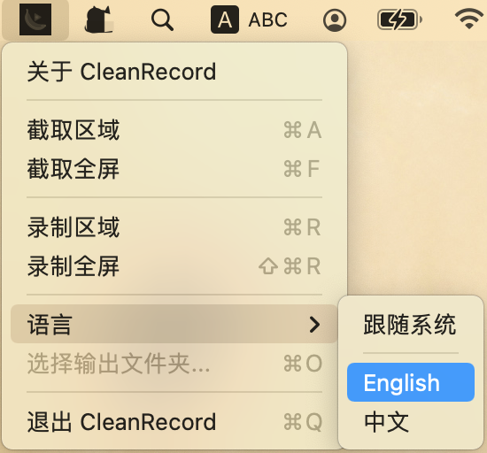

# CleanRecord

一款简洁优雅的 macOS 屏幕录制工具



## ✨ 特性

- 📹 **区域录制** - 自由选择录制区域
- 🖥️ **全屏录制** - 一键录制整个屏幕
- 📸 **区域截图** - 快速截取屏幕区域
- 🎥 **摄像头叠加** - 支持摄像头画中画
- 🎙️ **麦克风录音** - 可选麦克风音频录制
- 🌍 **国际化支持** - 支持中文和英文界面
- ⏸️ **暂停/继续** - 录制过程中可暂停和继续
- 🎨 **美颜滤镜** - 摄像头美颜效果
- 🔧 **高度可定制** - 摄像头形状、大小、位置可调

## 📦 安装教程

1. 克隆本仓库到本地
2. 确保已安装 Xcode 命令行工具 (`xcode-select --install`)
3. 在终端进入项目根目录

## 🚀 使用说明

### 开发调试
```bash
swift run
```

或使用 Xcode 打开 `Package.swift`

### 打包发布

本项目提供了自动打包脚本 `Package.sh`：

```bash
./Package.sh
```

打包完成后，在 `build/` 目录下会生成 `CleanRecord.app`，可直接拖入"应用程序"文件夹。

**脚本功能：**
- 使用 `swift build -c release` 编译发布版
- 自动创建 `Contents/MacOS` 和 `Contents/Resources` 目录结构
- 自动生成 `Info.plist`（包含摄像头和麦克风权限声明）
- 自动从 PNG 图标生成高分辨率的 `.icns` 图标集

### 手动打包步骤

如果需要手动操作：

```bash
# 编译
swift build -c release

# 创建目录
mkdir -p CleanRecord.app/Contents/MacOS

# 拷贝文件
cp .build/release/CleanRecord CleanRecord.app/Contents/MacOS/

# 添加 Info.plist
cp Info.plist CleanRecord.app/Contents/
```

> [!TIP]
> 如果需要在其他没有安装开发环境的 Mac 上运行，建议在打包后进行公证 (Notarization)，或者在首次运行时在"系统设置 -> 隐私与安全性"中点击"仍要打开"。

## 🎯 快捷键

- `⌘A` - 截取区域
- `⌘F` - 截取全屏
- `⌘R` - 录制区域
- `⇧⌘R` - 录制全屏
- `⌘P` - 暂停录制
- `⌘Q` - 退出应用

## 📝 技术栈

- Swift 5.6+
- SwiftUI
- ScreenCaptureKit
- AVFoundation
- macOS 12.3+

## 🤝 问题反馈

如果您在使用过程中遇到任何问题或有功能建议，欢迎：

- 📮 [提交 Issue](https://github.com/your-repo/clean-record/issues)
- 💬 扫码联系

<div align="center">
  
  <p><i>扫码联系开发者</i></p>
</div>

---

<div align="center">
  Made with ❤️ by CleanRecord Team
</div>